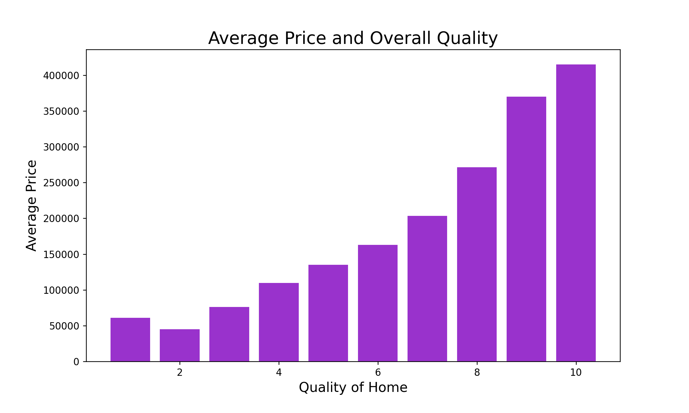

# Ames Housing Data Analysis

##### Overview: [1. Cleaning](https://github.com/scaress21/ames_housing/blob/master/code/01_Cleaning.ipynb) | [2. EDA](https://github.com/scaress21/ames_housing/blob/master/code/02_EDA.ipynb) | [3A. MLR Model](https://github.com/scaress21/ames_housing/blob/master/code/03A_MLR_Model.ipynb) | [3B. Ridge Model](https://github.com/scaress21/ames_housing/blob/master/code/03B_Ridge_Model.ipynb) | [3C. LASSO Model](https://github.com/scaress21/ames_housing/blob/master/code/03C_LASSO_Model.ipynb) | [4. Kaggle Submission](https://github.com/scaress21/ames_housing/blob/master/code/04_Kaggle_Submission.ipynb) | [5. Model for Presentation](https://github.com/scaress21/ames_housing/blob/master/code/05_Presentation_Model_and_Plots.ipynb)

## Problem Statement
Purchasing a home is often one of the biggest investments in someone's life. Naturally, homeowners want to do everything they can to get the highest return on their purchase. When it comes to remodeling and making improvements, what features should homeowners focus their money on to get the most value back?

## Data Overview
The housing data came from the Ames City Assessor's office. It contains over 80 columns of data on over 2000 houses. The columns range from categorical (i.e. Zone, Neighborhood) to quantitative (i.e. number of bathrooms) and qualitative (i.e. quality of the Kitchen) with many more inbetween. Several columns were missing large amounts of data (i.e. pool quality, fence) so they were removed. A more indepth explanation of every column can be found here: [Ames Data Documentation](http://jse.amstat.org/v19n3/decock/DataDocumentation.txt)

## Exploratory Data Analysis
Some early exploratory data analysis revealed strong correlation of sale price with two features in particular: overall quality and above grade square feet. 

Additionally, by utilizing barcharts and histograms, several of the categorical features such as Neighborhood and Subclass showed big differences in price across the categories. 

Using these findings as a jumping off point, I got to modeling but did more EDA as I explored and created new features between model iterations.

## Modeling
Using Multiple Linear Regression, I created several models starting with simple/straightforward features and moving into more complex feature engineering. I utilized the numeric columns with strong correlation to sale price, created dummies categories, and made a few interaction columns (i.e. beds * baths). As my models grew more complex, they generally got higher R2 scores on the train and test data and smaller root mean squared error. My best model had an R2 of .90 (meaning it accounted for 90% of the variance in sale price) and an RMSE of $20,845. While this model was the best for prediction, it was not the best for inference. Many of the features had been engineered in a way that didn't lend itself to clear interpretation. So, to answer the question at the core of this project, I scaled back the complexity of the model to be more interpretable. The model I landed on to highlight the key features homeowners should focus on when remodeling had an R2 of .81 and an RMSE of $33,236.

## Conclusions and Recommendations
After creating and evaluating several models, it became clear that quality had a huge impact on the price of a home. Overall quality, kitchen quality, and exterior quality were three categories that strongly influenced the price of the home. Just increasing the overall quality of a home from 1 to 10 has the potential of raising it's price by over $100k. I would recommend anyone looking to invest in their home to focus on the finishes and quality as it doesn't require changing any of the structural elements of the house. These modifications can be done on a smaller budget but can yield a big return on the investment.
